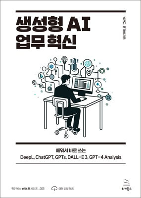

# 생성형 AI 업무 혁신
### 배워서 바로 쓰는 DeepL, ChatGPT, GPTs, DALL-E 3, GPT-4 Analysis

- **박찬규**, **윤가희** 지음
- ISBN: 9791158394851
- 판형: 152*220*22mm
- 22,000원 | 2024년 2월 15일 발행 | 396쪽
- [책 홈페이지](https://wikibook.co.kr/genai/)
- [도서 미리보기](http://www.yes24.com/Product/Viewer/Preview/124848883)
- [도서 관련 문의](https://wikibook.co.kr/support/contact/)

---

**실무에서 바로 활용할 수 있는 다양한 생성형 AI 활용 노하우를 알려드립니다!**

앞으로 5년 안에 모든 것이 바뀔 것이라고 많은 보고서가 예측하고 있습니다. 일상적인 언어로 하고 싶은 일을 말하기만 하면 되는 세상이 곧 도래할 것 같습니다. ChatGPT 열풍이 시작된 지 채 1년이 되지 않았지만 벌써 디자이너가 데이터를 분석하고, 개발자가 놀라운 품질의 디자인을 할 수 있는 세상이 됐습니다.

인공지능이 인간이 하는 일을 완전히 대체하는 세상이 언제 올지는 모릅니다. 하지만, 인공지능을 잘 사용하는 사람이 사용하지 못하는 사람을 대체하는 세상은 곧 도래할 것 같습니다. 빌 게이츠의 말대로 지금은 흥미롭고 혼란스러운 시기이며, 아직 AI를 최대한 활용하는 방법을 찾지 못했다면 이 책을 꼭 읽어보세요.

1년 동안 위키북스에서 출간한 다양한 생성형 AI 도서를 기획하고 공부하면서 정리한 내용을 책으로 엮었습니다. 책에서 정리한 지식이 여러분의 업무를 바꾸는 첫걸음이 되었으면 합니다.

---
 
 ## 구입처
 
 - [예스24](https://www.yes24.com/Product/Goods/124848883)
 - [교보문고](https://product.kyobobook.co.kr/detail/S000212219231)
 - [인터파크](https://book.interpark.com/product/BookDisplay.do?_method=detail&sc.prdNo=356867284)
 - [알라딘](https://www.aladin.co.kr/shop/wproduct.aspx?ItemId=333339893)

---

 ## 참고 자료 
 
  - [참고 자료](https://wikibook.github.io/genai/)
